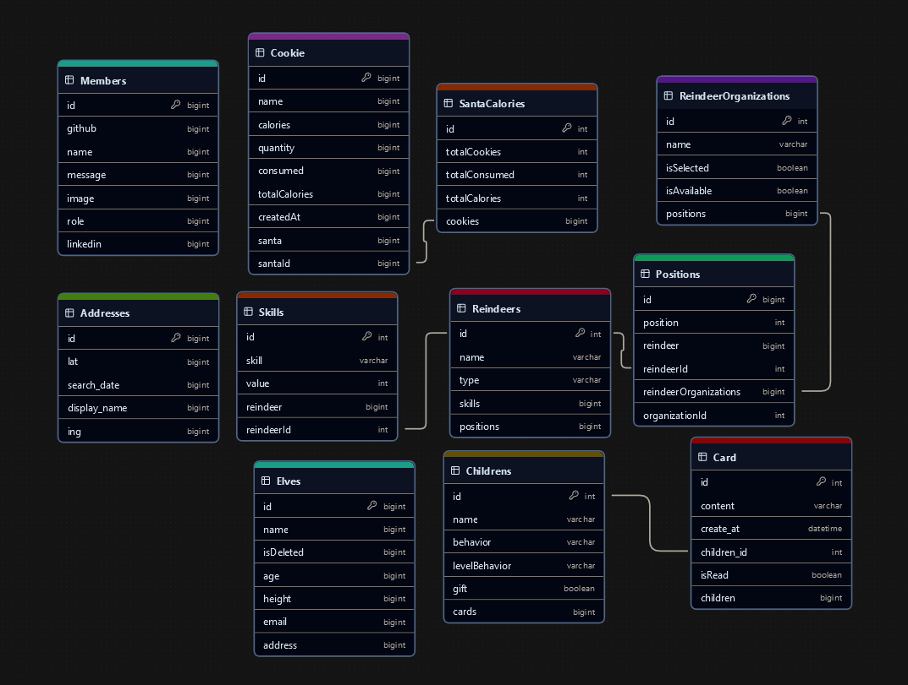

<div align="center">
 
  
  # Santa's Sight

  🎄 A robust system for managing holiday operations, responsible for handling business logic and data management.
<br>

## 🛠 Tech Stack


</div>


### Installation
1. clone this repository

   ```sh
   git clone https://github.com/TEAM3-ED8/back-end.git
   ```

2. install dependencies

   ```bash
   pnpm install
   ```

3. create .env file

   ```bash
   touch .env
   ```

4. write to .env

   ```bash
   DATABASE_URL=""
   ```

5. run the project
   ```bash
   pnpm run dev
   ```

## 📚 Documentation
For detailed technical documentation and specifications for our endpoints, please visit our Technical Documentation. [Technical Documentation](https://back-end-production-cb12.up.railway.app/api-docs/)

## 🏗 Project Structure

```
├── prisma/                # Prisma database configuration
│   ├── migrations/        # Database migrations
│   ├── schema.prisma     # Prisma schema
│   ├── seed.ts          # Database seeding
│   └── seed-data.ts     # Seed data
├── src/                  # Source code
│   ├── config/          # Configuration files
│   │   └── swagger.ts   # Swagger configuration
│   ├── controllers/     # Request handlers
│   │   ├── AddressesController.ts
│   │   ├── CardsController.ts
│   │   ├── ChildrensController.ts
│   │   ├── ElvesController.ts
│   │   ├── MembersController.ts
│   │   ├── ReindeerController.ts
│   │   ├── ReindeerOrganizationController.ts
│   │   └── SantaCookiesController.ts
│   ├── models/          # Data models
│   │   ├── ElvesModel.ts
│   │   ├── CardModel.ts
│   │   └── ...
│   ├── routes/          # API routes
│   │   ├── address.routes.ts
│   │   ├── card.routes.ts
│   │   ├── children.routes.ts
│   │   ├── elve.routes.ts
│   │   ├── index.ts
│   │   └── ...
│   ├── utilities/       # Utility functions
│   │   ├── catchedAsync.ts
│   │   ├── cors.ts
│   │   ├── errors.ts
│   │   └── ...
│   ├── app.ts          # Express application setup
│   ├── index.ts        # Entry point
│   ├── prisma.ts       # Prisma client
│   └── swagger.ts      # Swagger documentation 
├── .env                # Environment variables
├── .env.example        # Environment variables 
├── .gitignore          # Git ignore rules
├── eslint.config.js    # ESLint configuration  
├── package.json        # Project dependencies
├── pnpm-lock.yaml      # pnpm lock file
├── README.md           # Project documentation
└── tsconfig.json       # TypeScript configuration
```


## 🏗 Entity Relationship Diagram



## 📜 License

This project is licensed under the MIT License - see the [LICENSE](LICENSE) file for details.


---

<div align="center">
  Made with ❤️ by Team 3 ED8
</div>
